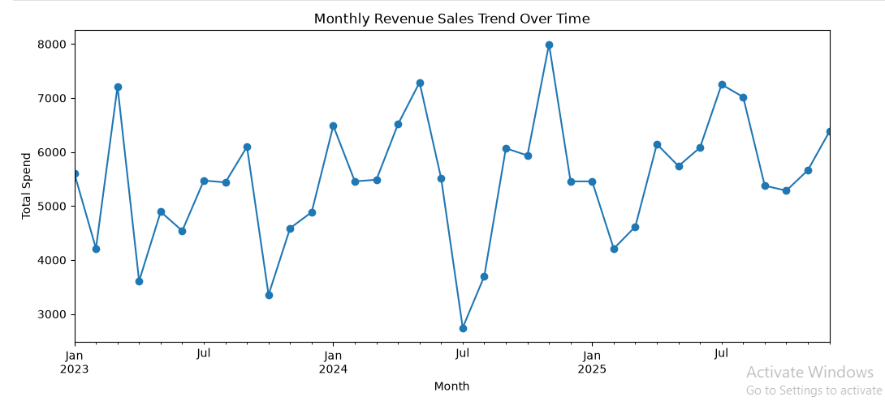

# Customer Purchase Behaviour Analysis (EDA)

## Problem Statement
Analyzed e-commerce transaction data to understand customer purchase behavior, sales trends over time, and top-performing products.

## Tools Used
- Python (Pandas, NumPy, Matplotlib, Seaborn)
- Jupyter Notebook

## Approach
1. Loaded and cleaned the e-commerce transactions dataset.
2. Converted date fields to proper datetime format for time-based analysis.
3. Analyzed monthly revenue trends using resampling.
4. Explored spend distribution per order.
5. Identified top-selling products (Smartwatch and other frequently ordered items).

## Key Findings
- Total revenue generated was **$197,786.36**, with an average order value of **$131.86**
- Most orders fall in the **$70.90 – $178.24** spend range (25th–75th percentile), with spend per order ranging from $8.30 to $498.92 overall
- No consistent month drove revenue every year — the top-spending month varied (March 2023, November 2024, July 2025), and Smartwatch was the single most popular product with 116 orders

## Files
- `P1-Customer purchase behaviour analysis using python(EDA).ipynb` — Full analysis notebook
- `ecommerce_transactions_full.xlsx` — Dataset used

## Screenshot

