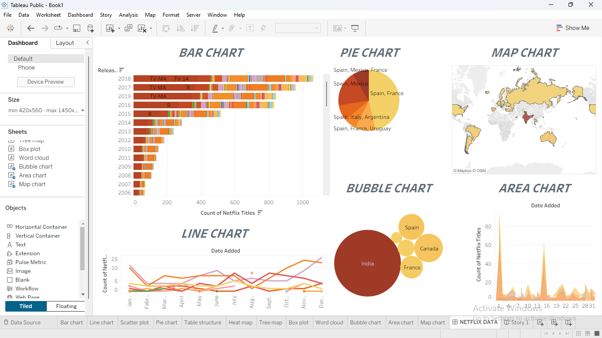

# Netflix Content Analysis — Tableau Dashboard

## Problem Statement
Analyzed Netflix's content catalog (6,234 titles) to uncover trends in content type, release patterns, global distribution, genres, and audience ratings — presented as an interactive Tableau story and dashboard.

## Tools Used
- Tableau Public / Tableau Desktop

## Data Overview
- **6,234 titles** (Movies and TV Shows combined).
- Fields tracked: Title, Type, Director, Cast, Country, Date Added, Release Year, Rating, Duration, Genre, Description.

## Approach
1. Cleaned the raw Netflix dataset — standardized country, genre, and date fields.
2. Built multiple chart types to explore the data from different angles: bar chart (titles by release year), pie chart (country distribution), map chart (global content origin), bubble chart (top contributing countries), line chart (monthly additions), and area chart (content added over time).
3. Combined all visuals into a single interactive **Dashboard**, and built a **Story** to walk through the key findings in sequence.

## Key Insights

**1. Content type split**
- **Movies: 4,265 (68%)** vs. **TV Shows: 1,969 (32%)** — Netflix's catalog is roughly twice as movie-heavy as TV shows.

**2. Content origin (Map & Bubble Chart)**
| Country | Titles |
|---------|--------|
| United States | 2,302 |
| India | 808 |
| United Kingdom | 483 |
| Canada | 206 |
| Japan | 184 |

🌍 **The US dominates the catalog**, contributing over a third of all titles, with **India as a clear second**, highlighting Netflix's strong investment in the Indian market.

**3. Content ratings**
- Most common rating: **TV-MA (2,027 titles)**, followed by **TV-14 (1,698 titles)** — together making up nearly 60% of the catalog, indicating Netflix's content skews toward mature/teen audiences rather than younger viewers.

**4. Top genres**
- **Dramas (1,077)**, **Comedies (803)**, and **Documentaries (644)** are the three most common genres on the platform.

**5. Growth over time (Line & Area Chart)**
- Netflix's catalog additions **surged dramatically between 2016–2019**, growing from 456 titles added in 2016 to a peak of **2,349 titles added in 2019** — reflecting the platform's aggressive content expansion phase during those years.
- Most content in the catalog was originally **released between 2015–2019**, showing Netflix leans heavily on recent content rather than older archives.

## Files
- `Netflix_data_report_storytelling.png` — Screenshot of the Tableau Story view
- `Netflix_dashboards.png` — Screenshot of the interactive Dashboard
- `netflix_dataset_clean.xlsx` — Cleaned dataset used for analysis
- `[your .twbx filename]` — Tableau packaged workbook (add this if not already uploaded)

## Key Takeaways
- Netflix's catalog is movie-dominant (68%) but has meaningfully invested in TV shows, especially international ones.
- The US and India are the two largest content sources by a wide margin — worth noting for anyone analyzing Netflix's regional content strategy.
- The 2016–2019 period marks Netflix's most aggressive content growth phase, useful context for understanding the platform's current catalog composition.
- Mature-audience content (TV-MA, TV-14) makes up the majority of the catalog, which may reflect both licensing patterns and Netflix's core adult demographic focus.

## Screenshots

